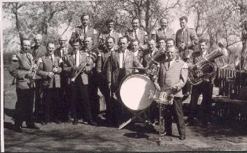
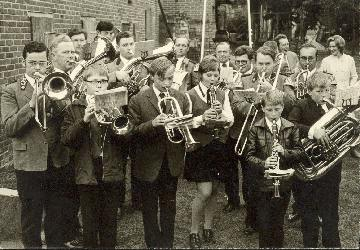
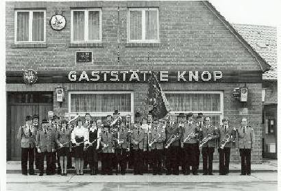
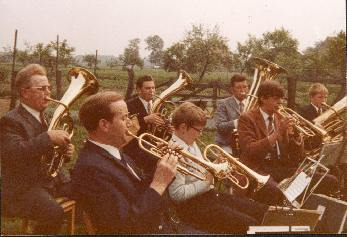
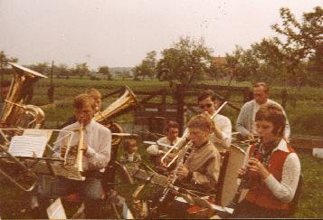
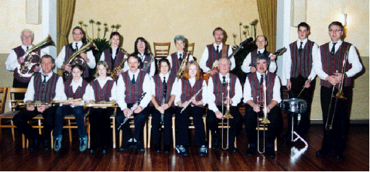



_1964 wurde die Schützenkapelle in Abbensen gegründet_

Im Schützenverein Abbensen war es seit vielen Jahrzehnten üblich, den Mitgliedern anlässlich von Hochzeiten ein Ständchen zu überbringen. Dazu marschierten die Mitglieder mit Musik zu dem Hochzeitspaar. Dort wurden die Glückwünsche über­bracht, von der Musik einige Stücke gespielt und vom Hochzeitspaar wurde der Ver­ein mit Getränken bewirtet. Im Anschluß daran ging der Verein zurück in das Ver­einslokal, wo die Musik zum Tanz aufspielte. Zusätzlich benötigte der Verein bei Be­erdigungen von Mitgliedern Musik, die den Trauerzug begleitete.

Die vom Verein benötigte Musik war im Verhältnis zu den geringen Einnahmen des Vereins teuer. Die Kosten dafür konnten zu Beginn der sechziger Jahre nicht mehr regelmäßig aus der Vereinskasse bezahlt werden. So mussten die Schützenkamera­den bei Ständchen für die Musik eine kleine Umlage zahlen. Um nicht auf Dauer hohe Beträge für Musik aufbringen zu müssen, beschloss der Verein im Jahre 1963, eine eigene Musikkapelle zu gründen.

Für den Ankauf von Instrumenten wurde von den Mitgliedern des Vereins eine Um­lage erhoben. Hinzu kamen zum Teil großzügige Spenden von Schützenkameraden und anderen an der Kapelle interessierten Personen, und bald war die Finanzierung für den Kauf von gebrauchten Instrumenten sichergestellt.

Es waren etwa 20 Schützen vorhanden, die musizieren wollten. Die Mehrzahl von Ihnen kannte jedoch noch nicht einmal Noten. Der damalige Leiter der Volksschule Abbensen, Herr Hans-Georg Hullmann, vermittelte diesen Interessenten Anfang des Jahres 1964 die erforderlichen Notenkenntnisse.

Als Leiter der Schützenkapelle wurde Wigand Kusitzky aus Abbensen gewonnen, der auch die musikalische Ausbildung übernahm. Neben Ihm waren vier weitere Mit­glieder vorhanden, die bereits seit mehreren Jahren ein Instrument spielten. Die Mit­glieder der Kapelle wollten nun möglichst bald für den Verein blasen. Um dieses zu erreichen, erhielten die Kameraden nur eine kurze Ausbildung anhand geeigneter Notenschulen, um dann bald Choräle und einfache Märsche zu üben. Der erste pri­vate Auftritt erfolgte bereits im November 1964 anlässlich eines Geburtstages. Im Januar 1965 sorgte die Schützenkapelle erstmalig für den musikalischen Rahmen der Jahreshauptversammlung des Schützenvereins. Sie wurde dabei noch von Mit­gliedern der Feuerwehrkapelle Soltau unterstützt. Von da an übernahm die Schüt­zenkapelle dann das Blasen bei Hochzeiten und Beerdigungen.

 | 

Um möglichst bald eine etwas größere Auswahl von Musikstücken zu erreichen, üb­ten die Bläser zweimal in der Woche. Neben dem Blasen musste auch das Marschie­ren während des Spielens geübt werden. Dies bereitete zunächst Schwierigkeiten, die aber überwunden wurden, nachdem der "Moorweg" an einigen Sonntagen als Übungsstrecke genutzt worden war.

Manche der Interessenten stellten bereits nach kurzer Zeit fest, dass das Musizieren erheblichen Einsatz, Fleiß und Zeit erforderte. Es schieden daher Mitglieder aus und neue Bewerber, insbesondere Jugendliche, mussten ausgebildet werden.

Die Schützenkapelle spielte vom folgenden Jahr an auch bei Schützenfesten und ähnlichen Veranstaltungen in der näheren und weiteren Umgebung von Abbensen. Für das dafür erhaltene Entgelt sowie aufgrund von weiteren Spenden und Zuschüs­sen konnten alle gebrauchten Instrumente, die im Jahre 1964 angeschafft waren, durch neue ersetzt werden.

Anlässlich ihres zehnjährigen Bestehens im Jahr 1974 gab die Schützenkapelle ein großes öffentliches Konzert. Dieses wurde von den Zuhörern begeistert aufgenom­men und seitdem jährlich wiederholt.

 

Wie viele andere Blaskapellen hatte auch die Schützenkapelle in den achtziger Jah­ren Nachwuchsmangel. Da mehrere Bläser aus verschiedenen Gründen aus der Ka­pelle ausgeschieden waren, konnten ab 1989 keine regelmäßigen Konzerte mehr gegeben werden.

Nachdem Wigand Kusitzky die Schützenkapelle nicht mehr leiten wollte, übernahm Eberhard Horn aus Vesbeck im Jahr 1982 die Leitung. Von 1988 bis 1994 war Klaus Mengeler aus Brelingen der musikalische Leiter der Schützenkapelle. Seit dem Jahr 1994 hat Olaf Metterhausen aus Helstorf die Leitung der Schützenkapelle.

Die Mitglieder der Kapelle haben viel Freizeit aufgewendet, um Andere mit ihrer Mu­sik zu erfreuen. Es war nicht unbedingt ein Vergnügen, wenn bei einem Umzug die Schuhe vom Regen mit Wasser gefüllt waren oder die Uniformjacke bei großer Hitze durchgeschwitzt war. Insbesondere die Konzerte erforderten von allen Mitgliedern einen besonderen Einsatz. Sie haben dennoch in allen Jahren viel Spaß mit der Mu­sik erlebt und sie zu ihrem Hobby gemacht. Drei der Gründer spielen heute noch mit und können bestimmt viele Abende von ihren Erlebnissen in der Kapelle erzählen. Dabei dürften die erfreulichen Erinnerungen zweifellos zahlreicher sein als die im Lauf der Jahre gelegentlich aufgetretenen Schwierigkeiten.

In den letzten Jahren konnten in dem erforderlichen Umfang Nachwuchsbläserinnen und -bläser gefunden werden. Damit ist auch weiterhin der bereits seit vielen Jahren bestehende Leistungsstandard der Schützenkapelle sichergestellt, der regelmäßig noch gesteigert worden ist. Dabei ist die umfangreiche Auswahl der dargebotenen Stücke hervorzuheben, die von der klassischen Volksmusik mit Marsch, Walzer und Polka über Schlager, Musical und Jazz bis zu Melodien im Big-Band- Klang reicht.

Die Schützenkapelle erfüllt nicht nur den Zweck, für den sie vor mehr als 35 Jahren gegründet wurde, sondern trägt auch darüber hinaus erheblich zum kulturellen Leben in Abbensen und der näheren Umgebung bei. Es ist zu hoffen, dass sich immer wie­der Personen finden, die Interesse an der Musik haben und der Bestand der Schüt­zenkapelle über viele Generationen gewährleistet wird.

